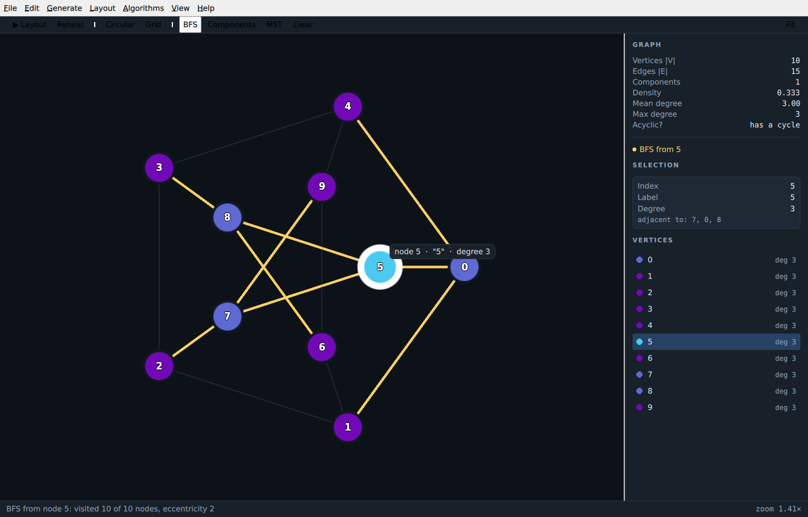
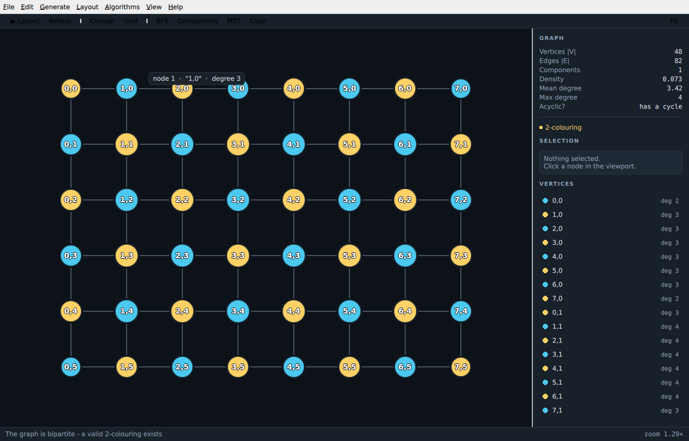

# GraphLab

A small Qt Quick application for exploring graph theory, written to be **read**
rather than shipped. It is a worked example of the three things people usually
want to see together and rarely find in one place:

* a **Qt Quick** UI with a real menu bar, dialogs, and a model-driven side panel,
* an **OpenGL viewport** doing its own rendering inside that UI,
* a **plain C++ core** that neither of them can contaminate.



*Breadth-first search from vertex 5 of the Petersen graph. Node colour is
distance from the source, amber edges are the BFS tree, and the amber-dimmed
edges are the ones BFS never used.*

---

## Building

Needs Qt 6.2 or newer, CMake 3.21+, and a compiler with C++17.

```bash
cmake -S . -B build -G Ninja -DCMAKE_BUILD_TYPE=Release
cmake --build build
./build/graphlab
```

On Debian/Ubuntu the dependencies are:

```bash
sudo apt install cmake ninja-build build-essential \
     qt6-base-dev qt6-declarative-dev libgl1-mesa-dev \
     qml6-module-qtquick-controls qml6-module-qtquick-layouts \
     qml6-module-qtquick-dialogs qml6-module-qtqml-workerscript
```

The `qt6-*-dev` packages give you the headers to build against; the `qml6-module-*`
packages are the QML modules the app imports **at run time**. Missing one of those
produces `module "QtQuick.Controls" is not installed` from an otherwise
perfectly-compiled binary — a distinction that catches everybody once.

Run the tests for the graph core with:

```bash
ctest --test-dir build --output-on-failure
```

---

## Using it

| | |
|---|---|
| Pan | drag the background |
| Zoom | mouse wheel (zooms about the cursor) |
| Select a node | click |
| Move a node | drag it |
| Add / remove an edge | select a node, then **Shift**-click another |
| Add a node | double-click empty space |
| Pin a node in place | right-click it, or press **P** |
| Run the force layout | **Space** |
| Frame the graph | **F** |

Start from **Generate** to get a graph, run something from **Algorithms**, and
watch the viewport recolour. Try `Generate ▸ Grid`, then
`Algorithms ▸ Bipartite / 2-Colouring`:



---

## How it fits together

```
                    QML (declarative, GUI thread)
   ┌───────────────────────────────────────────────────────┐
   │  Main.qml        window, menu bar, toolbar, dialogs   │
   │  Viewport.qml    input handlers + text labels         │
   │  InspectorPanel  statistics and the vertex list       │
   └───────────────┬───────────────────────┬───────────────┘
                   │ properties/signals    │ properties/invokables
   ┌───────────────▼───────────┐   ┌───────▼───────────────┐
   │  GraphController (QObject)│   │  GraphView (QQuickItem)│
   │  the one QML-facing class │◄──┤  camera + hit testing  │
   └───────────────┬───────────┘   └───────┬───────────────┘
                   │                       │ createRenderer()
                   │              ─ ─ ─ ─ ─┼─ ─ ─ thread boundary ─ ─
                   │                       │
   ┌───────────────▼───────────┐   ┌───────▼───────────────┐
   │  Graph, algorithms,       │   │  GraphRenderer         │
   │  generators, force layout │   │  raw OpenGL, VAOs,     │
   │  → plain C++, no Qt GUI   │   │  instanced draw calls  │
   └───────────────────────────┘   └────────────────────────┘
```

| File | What it is there to show |
|---|---|
| `CMakeLists.txt` | `qt_add_executable`, `qt_add_qml_module`, singleton registration |
| `src/main.cpp` | why `QSurfaceFormat` and `setGraphicsApi` must run before any window |
| `src/graph.*` | a data structure with **no Qt GUI dependency at all** |
| `src/graphalgorithms.*` | BFS, DFS, components, Dijkstra, Kruskal, 2-colouring |
| `src/graphgenerators.*` | K*ₙ*, C*ₙ*, grids, trees, hypercubes, Petersen, G(n,p) |
| `src/forcelayout.*` | Fruchterman–Reingold with annealing |
| `src/graphcontroller.*` | `Q_PROPERTY`, `Q_INVOKABLE`, `QML_ELEMENT`, `QTimer`, JSON I/O |
| `src/nodelistmodel.*` | `QAbstractListModel` with named roles |
| `src/graphview.*` | the GUI-thread half of the OpenGL item |
| `src/graphrenderer.*` | the render-thread half: shaders, VBOs, instancing |
| `qml/Main.qml` | `ApplicationWindow`, `MenuBar`, and `Action` reuse |
| `qml/Viewport.qml` | input handlers, and Qt Quick text layered over OpenGL |
| `tests/tst_graphcore.cpp` | Qt Test over the core, no window required |

---

## The Qt ideas, and where to find them

### 1. The meta-object system is the whole trick

`Q_OBJECT` in a header makes moc generate the machinery for signals, slots and
introspection. Everything else builds on it:

* **`Q_PROPERTY(int nodeCount READ nodeCount NOTIFY graphChanged)`** — the
  `NOTIFY` half is the important half. It is what lets a QML binding know when
  to re-evaluate. A property without one is a property QML will read exactly
  once and then never look at again.
* **`Q_INVOKABLE`** makes a normal method callable from QML.
* **`QML_ELEMENT`** registers the class as a QML type named after the class.
  There is no `qmlRegisterType` call anywhere in this project; CMake and moc do
  it from the annotation.

### 2. Bindings track *properties*, not function calls

The subtlest bug in this project, left in `Viewport.qml` with a comment because
it is worth meeting once. The node labels are positioned like this:

```qml
x: (worldX - graphView.centre.x) * graphView.zoom + graphView.width / 2 - width / 2
```

The obvious alternative reads better and is silently broken:

```qml
x: graphView.toItem(Qt.point(worldX, worldY)).x     // DON'T
```

`toItem()` is a `Q_INVOKABLE`, and QML has no way to know that its result
depends on the camera. The binding records a dependency on `worldX`/`worldY`
only, so the labels freeze wherever the camera happened to be when they were
created — and everything *looks* fine until you pan.

### 3. One `Action`, many places

`Main.qml` defines each command once as an `Action` carrying its text, shortcut,
enabled state and handler. The menu item and the toolbar button both point at
that same object, so they cannot drift apart. `actionRunLayout` goes further and
binds `checked` to a C++ property, so the menu's check mark tracks the
simulation even when the simulation stops itself.

### 4. Models, not arrays

`NodeListModel` is a `QAbstractListModel` exposing named roles (`label`,
`worldX`, `degree`, …). The same model instance feeds *both* the vertex list in
the inspector and the label `Repeater` in the viewport. Positions change ~60
times a second during the layout, and the model emits one `dataChanged()` over
the two position roles rather than resetting — views keep their delegates and
re-evaluate only what moved.

### 5. Qt Quick renders on another thread

This is the part that makes OpenGL-in-Qt-Quick feel strange until it clicks.
`QQuickFramebufferObject` splits the item in two:

* **`GraphView`** lives on the GUI thread and holds the properties QML binds to.
* **`GraphRenderer`** lives on the **render thread** and owns every GL object.

They meet in exactly one function:

```cpp
void GraphRenderer::synchronize(QQuickFramebufferObject *item)
```

Qt calls it with the **GUI thread blocked**. That is the only moment when it is
safe to read the item and the graph, so `synchronize()` copies everything
`render()` will need into flat float arrays and touches nothing afterwards.
Reaching back into the controller from `render()` would be a data race that
happens to work most of the time — the worst kind.

The other half of the contract: a new frame is requested by calling `update()`
on the *item*, which `GraphView` does when the controller says something
changed. It is tempting to call `update()` at the end of `render()` instead;
that spins the GPU at full rate forever. Idle CPU for this app is 0%.

### 6. Qt 6 renders through the RHI, so ask for OpenGL

Qt 6 abstracts the graphics API behind the RHI and may choose Vulkan, Metal or
D3D. `QQuickFramebufferObject` only works on the OpenGL backend, so `main.cpp`
requests it explicitly *before* any window exists:

```cpp
QSurfaceFormat::setDefaultFormat(format);                  // GL 3.3 core
QQuickWindow::setGraphicsApi(QSGRendererInterface::OpenGL);
```

Both calls are order-sensitive. After a window exists they are ignored.

### 7. The actual OpenGL

Two draw calls per frame, regardless of graph size:

* **Edges** are expanded on the CPU into two triangles each. The vertex shader
  offsets the corners along the edge normal by a *pixel* amount and divides by
  the zoom, so lines keep a constant on-screen thickness at any magnification —
  which `glLineWidth` cannot give you portably.
* **Nodes** are drawn with **instancing**: one shared four-vertex quad, plus a
  per-instance buffer of centre / radius / colours. `glVertexAttribDivisor(loc, 1)`
  is the single call that turns "one quad" into "one quad per node". The disc
  itself is cut out in the fragment shader from the distance to the quad centre,
  antialiased with `fwidth`, so circles stay perfectly smooth at any zoom.

### 8. Re-skinning controls

Qt Quick Controls' default *Basic* style is light. Every control exposes its
chrome as a replaceable item, so `ParameterDialog.qml` assigns its own
`background`, `header` and `footer` rather than writing a whole custom style.
(Symptom worth recognising: theme-coloured text that is invisible because only
the *text* was themed and the surface underneath was not.)

---

## Things deliberately left undone

Good next exercises, roughly in order of difficulty:

1. **Edge weights.** The core already carries `Edge::weight` and Dijkstra and
   Kruskal already use it — but nothing sets it to anything but 1. Add a weight
   editor and the shortest-path highlight immediately gets more interesting.
2. **Directed graphs.** `Graph` is undirected by construction. Adding direction
   touches the adjacency list, the algorithms, and arrowhead rendering.
3. **More algorithms.** Articulation points and bridges (DFS low-link) fit the
   existing highlight mechanism exactly: write colours, emit `highlightsChanged`.
4. **Barnes–Hut.** The force layout is O(n²) per step, which is fine to a few
   thousand nodes. A quad tree makes it O(n log n).
5. **Undo/redo.** `QUndoStack` over the editing operations in `GraphController`.
6. **Move the layout off the GUI thread.** It currently runs in a `QTimer`;
   a `QThread` plus double-buffered positions is the natural progression, and
   forces you to think about the same synchronisation the renderer already does.

## Notes and caveats

* Everything here was built and exercised against **Qt 6.4**. Newer Qt adds
  conveniences this code avoids on purpose so it stays portable — notably
  `QQmlApplicationEngine::loadFromModule()` (6.5+) and
  `pragma ComponentBehavior: Bound` (6.5+).
* `qmllint` reports unresolved-type warnings inside `Viewport.qml` because Qt
  6.4's type registration does not describe `QQuickFramebufferObject` subclasses
  fully. The app runs correctly; the warnings are a tooling gap.
* If the viewport ever renders upside down on your driver, the flip lives in one
  place: the `ortho()` call in `GraphRenderer::synchronize()` deliberately
  passes `bottom > top` so world *y* grows downwards like Qt's item coordinates.
